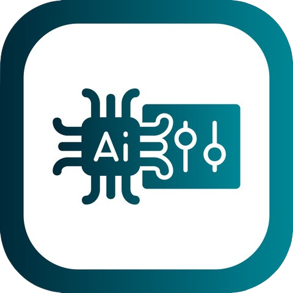

  

<h1 align="center"> Detection Edge AI </h>

  
  

## Table of Contents

- [Overview](#overview)
- [Artificial-intelligence](#artificial-intelligence)
- [Edge-computing-environment](#edge-computing-environment)
- [Configuration](#configuration)